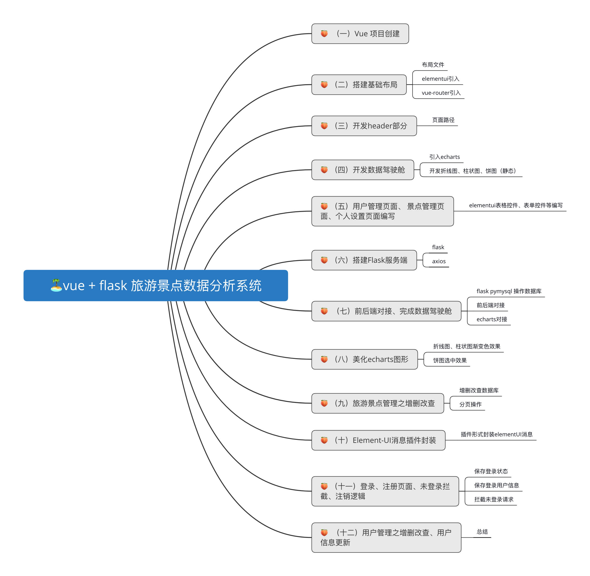
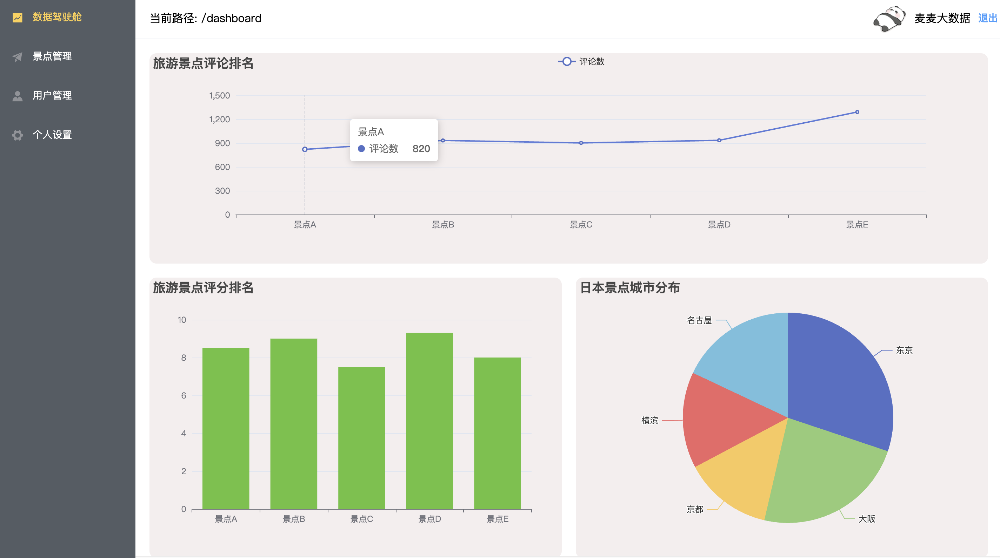
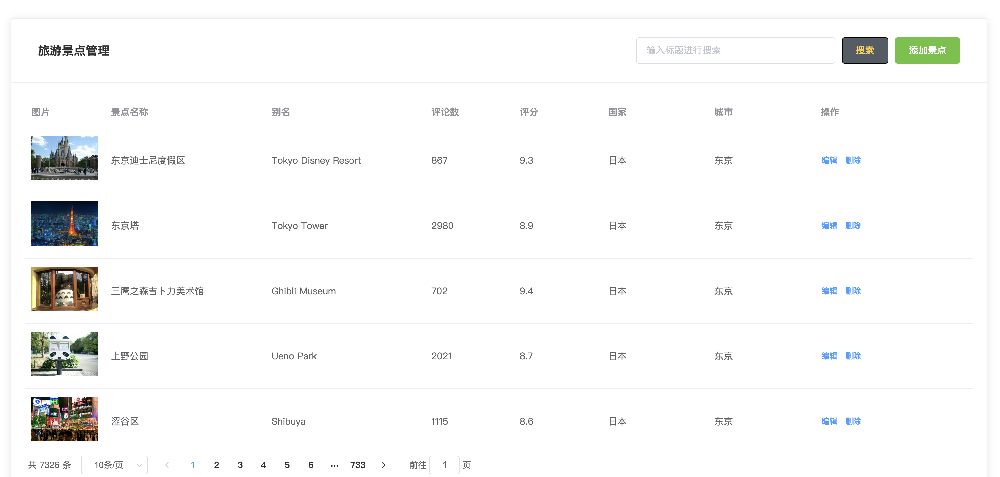
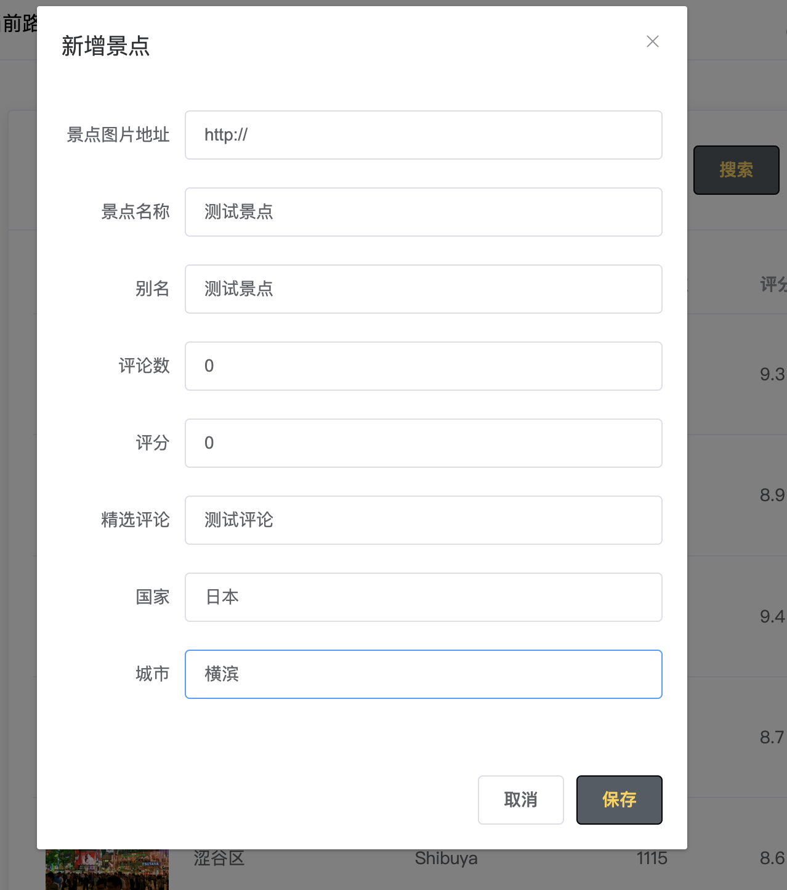

# 🥥 vue+flask旅游数据分析系统

基于[scrapy爬取到的景点和评论数据](https://blog.csdn.net/roccreed/article/details)，本期开始搭建一个vue+flask的前后端分离的数据分析系统。
本教程为麦麦原创，也可以去B站找我 👉🏻 [我的空间](https://space.bilibili.com/1583208775)

## 后端工程 && 数据库表
🖋 [github](https://github.com/redcomet88/tour-flask)

## 🧑‍🎓 前置课程
🕸 [scrapy实战 爬取景点信息和评论](https://blog.csdn.net/roccreed/article/details/140680833)
## 📊 教程目录
📺 视频地址: 制作中
- 🖋 [从0开始搭建vue + flask 旅游景点数据分析系统（一）：创建前端项目](https://blog.csdn.net/roccreed/article/details/140734085)
- 🖋 [从0开始搭建vue + flask 旅游景点数据分析系统（二）：搭建基础框架](https://blog.csdn.net/roccreed/article/details/140737467)
- 🖋 [从0开始搭建vue + flask 旅游景点数据分析系统（三）：开发header部分](https://blog.csdn.net/roccreed/article/details/140746449)
- 🖋 [从0开始搭建vue + flask 旅游景点数据分析系统（四）：编写前端首页【数据驾驶舱】](https://blog.csdn.net/roccreed/article/details/140749716)
- 🖋 [从0开始搭建vue + flask 旅游景点数据分析系统（五）：【用户管理页面、 景点管理页面、个人设置页面编写】](https://blog.csdn.net/roccreed/article/details/140804831)
- 🖋 [从0开始搭建vue + flask 旅游景点数据分析系统（六）：搭建后端flask框架](https://blog.csdn.net/roccreed/article/details/140862893)
- 🖋 [从0开始搭建vue + flask 旅游景点数据分析系统（七）：可视化前后端对接实现](https://blog.csdn.net/roccreed/article/details/140927803)
- 🖋 [从0开始搭建vue + flask 旅游景点数据分析系统（八）：美化前端可视化图形](https://blog.csdn.net/roccreed/article/details/140931449)
- 🖋 [从0开始搭建vue + flask 旅游景点数据分析系统（九）：旅游景点管理之增删改查](https://blog.csdn.net/roccreed/article/details/141182627)
- 🖋 [从0开始搭建vue + flask 旅游景点数据分析系统（十）：Element-UI消息插件封装](https://blog.csdn.net/roccreed/article/details/141187650)
- 🖋 [从0开始搭建vue + flask 旅游景点数据分析系统（十一）：登录、注册页面、未登录拦截、注销逻辑](https://blog.csdn.net/roccreed/article/details/141231452)
- 🖋 [从0开始搭建vue + flask 旅游景点数据分析系统（十二）：用户管理之增删改查、用户信息更新](https://blog.csdn.net/roccreed/article/details/141231610)
## 1 通过这个系列教程可以学习到什么？

- ✅  从0开始搭建一个  vue + flask 的数据分析系统；
- ✅  了解系统的整体架构，前后端交互、 后端与数据库的交互方式；
- ✅  几种常用的 echarts 图形的如何使用；
- ✅  element-ui 搭建管理程序布局风格的系统；
- ✅  flask 后端框架作为服务端使用；
- ✅   推荐算法的集成（如果时间安排来得及的话）；

### 思维导图

### 部分效果

